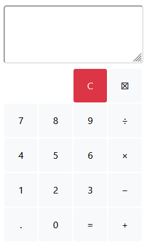

# Simple Calculator
Calculator application using HTML, CSS, JS, Django.

## Screenshots



### Clone the project

```
git clone https://github.com/Frozziie/django-calculator.git
```

### Install dependencies & activate virtualenv

```
1. Install
pip install virtualenv

2. Create virtual environment
virtualenv <name>

3. Activate
<name>\Scripts\activate (windows)

4. Dependencies
pip install -r requirements.txt
```

### Running

#### A development server

Just run this command:

```
python manage.py runserver
```